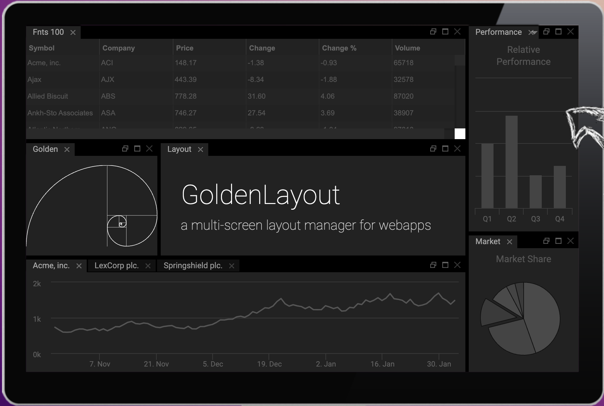

# Data Mesh

This lab was started in October 2023 to showcase a number of exciting technologies:
 * real-time analytics platform
 * a micro front-end and micro-service architecture on kubernetes
 * a decoupled, decentralised business platform

These constituent components and concepts are all very reusable and interesting in their own right. Put together, they showcase a great way to help businesses stay lean and value-focused.

## The term "Data mesh"
Amazon defines a [data-mesh](https://aws.amazon.com/what-is/data-mesh/) as:

```
... an architectural framework that solves advanced data security challenges through distributed, decentralized ownership. Organizations have multiple data sources from different lines of business that must be integrated for analytics.
...
```

# UI Design / Flow

Ultimately this lab produces an analytics dashboard where individual widget components can be quickly created to service disparate users.

To see the user-interface and flow design, see [here](./ui.md)

To understand the constituent components needed to create that UI, you can check out the design document [here](./design.md).



# Building

If you want to try it out or contribute, start [here](./running.md).

# Business Case / Rationale 

See [here](./requirements.md) for the rationale behind this platform