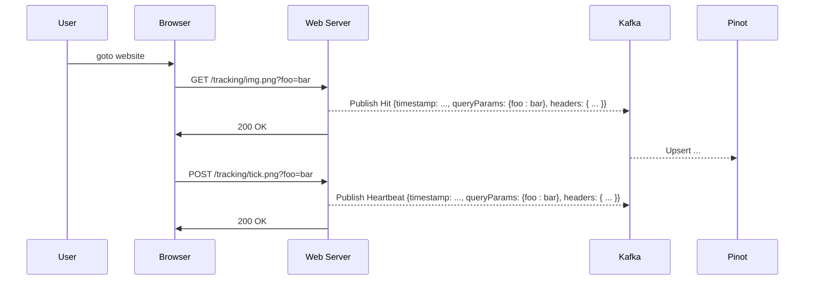

# Data

For the analytics portion of this demo, we'll want to emulate a "tracking pixel" emplanted on websites:

That request for a small, single-byte 1x1 image is the tracking pixel. The act of making that request to the server is tracked and used to inform the website owner who is visiting the website, from where, and for how long.

For this lab, we could actually create the REST service which serves the tracking pixel, but we could just as easily create a little test UI which allows us to push data into Kafka.

## Data Model
The salient points of information we'll want to track are:
 * timestamp
 * hostname
 * slug (the part of the URL after the host)
 * query params (the arbitrary key/value pairs in the web query)

 