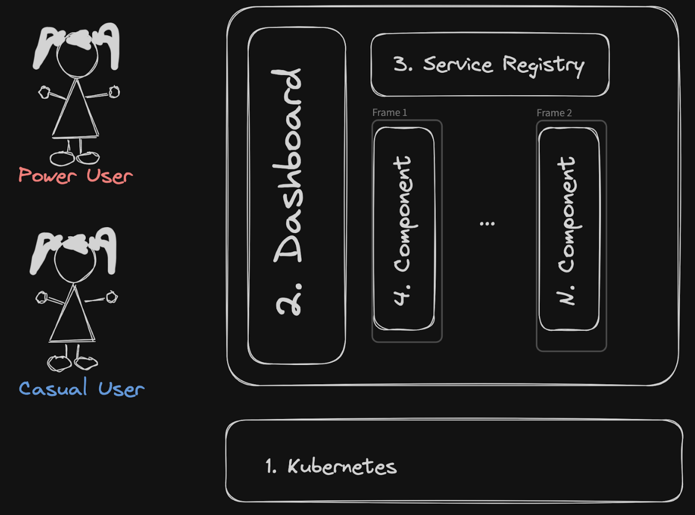
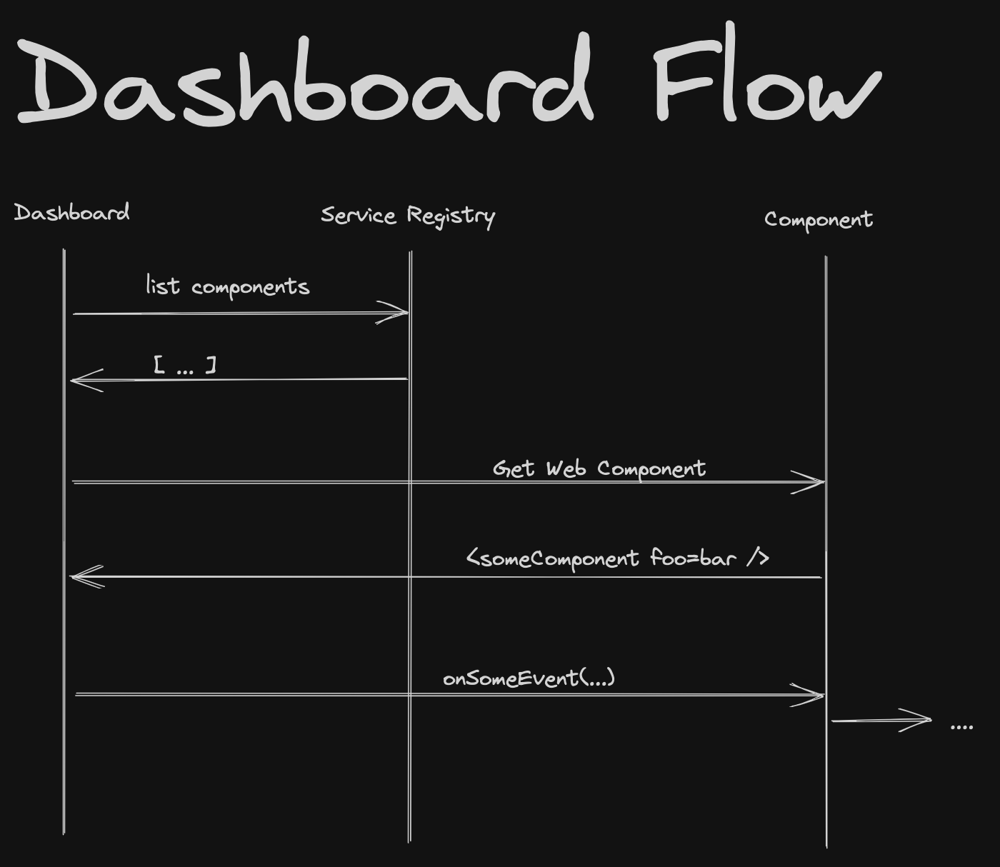

## Design

We split this platform into four distinct milestone deliverables:

1. the underlying platform (Kubernetes)
2. the user-facing dashboard windowing component
3. the service registry which supports the dynamic creation of services and service discovery by the dashboard
4. One or more widget components which can serve up the javasccript/css needed to display their [Web Components](https://developer.mozilla.org/en-US/docs/Web/API/Web_components)

The internal component flow will be something like this:

## The reasoning behind the different components

You can think of it like this:

We need some software which can serve up the windowing functionality. This is the dashboard.

That dashboard needs to present to the user a choice of what widget content it should put in each frame. For this, it asks the service registry.

We want to be able to create simple widgets for our users to pick from - ideally in whatever framework (vue.js, next.js, svelte, etc) we want. Those are the components, and they'll need to register themselves with the service registry.

For all this software to work, we'll have to package it up (docker containers), and have something which can run those packaged-up docker containers (kubernetes).

The individual components which make up this platform are

### 1. Kubernetes

To keep the deployment code simple and portable, we're basing our architecture on kubernetes, and use ArgoCD for the deployment.

This has the added benefit of proving a great dev experience to developers, who will be able to run the whole stack locally.

We have [kindservices/local-kubernetes](https://github.com/kindservices/local-kubernetes) for running locally, and [kindservices/datamesh-aws-k8s](https://github.com/kindservices/datamesh-aws-k8s) for provisioning on AWS

### 2. The "data-mesh" Service Registry

This is a simple REST service for service disovery

The github repo is at [kindservices/datamesh-service-registry](https://github.com/kindservices/datamesh-service-registry)

### 3. The Dashboard

This the windowing component which knows how to display web components.

The github repo is at [kindservices/datamesh-dashboard](https://github.com/kindservices/datamesh-dashboard)

### 4. The Widgets Components

The github repo is at [kindservices/datamesh-component-svelte](https://github.com/kindservices/datamesh-component-svelte)

We want these widgets to be as close to vanilla web components as possible, without the complexity of having to know about the data-mesh platform.

We can make this possible by separating the concern of registering with our service registry into a [sidecar](https://kubernetes.io/blog/2023/08/25/native-sidecar-containers/).

### 5. An example tracker component

We want one of our components to include an analytics example based on having a tracking-pixel and corresponding display based on Apache Pinot.

