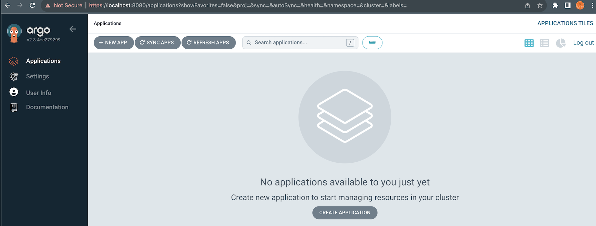
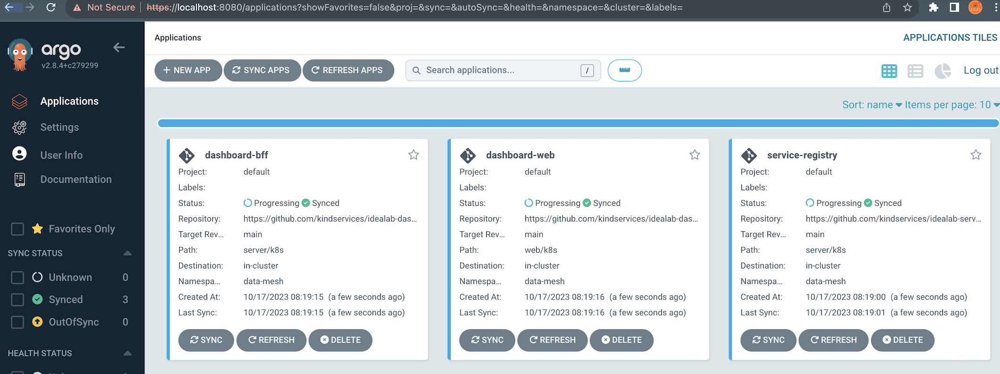
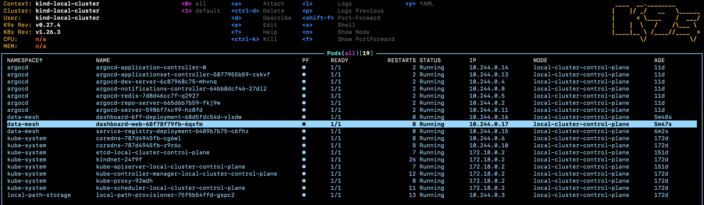

# Running

You can run the data-mesh locally, or easily port it to your own kubenetes cluster in whichever cloud you use.

Note: Our repos use [Makefile](https://opensource.com/article/18/8/what-how-makefile)s as a means to build.

## Running Locally

Our data-mesh is based on kubenetes and ArgoCD. 

To get started with those technologies, you can clone our [kindservices/local-kubernetes repo](https://github.com/kindservices/local-kubernetes):
```bash
git clone https://github.com/kindservices/local-kubernetes.git && cd local-kubernetes

# install Kind (kubernetes in docker), k9s and argocd
make install

# port-forward argocd UI to localhost and login so the 'argocd' command works from your command line
make login
```

Once running, you should have any empty ArgoCD instance locally:




# Installing the components

You can use the [bootstrap.sh](./bootstrap.sh) script to clone and install each of the different services.

It works because each individual component knows how to install itself using `argocd`:

```bash
# if you're using local kubernetes 
git clone https://github.com/kindservices/local-kubernetes.git 
pushd ./local-kubernetes
# if already installed this should just have no effect
make install
make login
popd

git clone https://github.com/kindservices/datamesh-service-registry.git && ./datamesh-service-registry/install.sh
git clone https://github.com/kindservices/datamesh-dashboard.git && ./datamesh-dashboard/install.sh
git clone https://github.com/kindservices/datamesh-component-pinot.git && ./datamesh-component-pinot/install.sh
```


You should then be able to see the components installing in argo:


Or check them out in the 'data-mesh' namespace using a tool like [k9s](https://k9scli.io/):



# Creating new components

We've created a widget template for creating new web components.

There could be multiple templates, perhaps for different web frameworks or use-cases.

The idea is that you can bootstrap a new component which knows:
 * How to produce a web component
 * How to package itself up and push an image (github actions to dockerhub)
 * How to deploy itself (a kubernetes service declaration, as well as an 'installArgo' Makefile target)

 You can read more and follow the instructions at our [kindservices/datamesh-widget-svelte.g8](https://kindservices.github.io/datamesh-widget-svelte.g8/) github repo


# Cleaning up
If you want to start over/get stuck, you can wipe-out your kubernetes applications by using:
```
# delete all your data-mesh components
kubectl delete namespace data-mesh

# delete argocd itself
kubectl delete namespace argocd
```