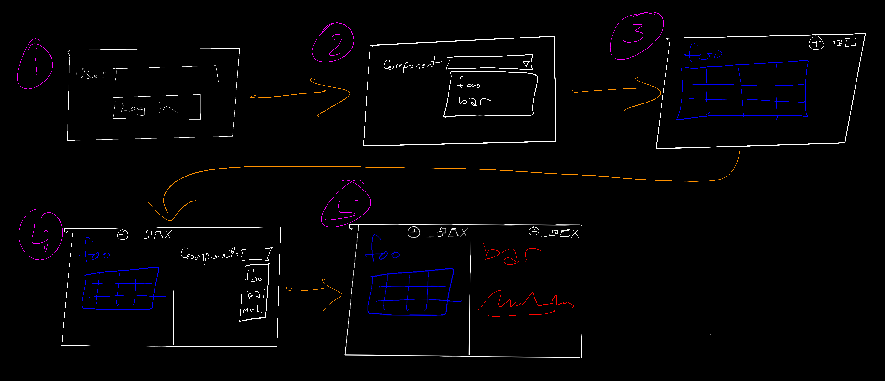

# User Interface

We're creating an internal-facing web application based on [golden-layout](https://golden-layout.com/):

Power-users will be able to add widgets to their dashboard and lay them out in a way which delivers the information they need. 

Different areas of the business will want different information, and so they'll be able to create their own views with their own widgets.

Casual users will be able to see a distraction-free layout based on a power-user's customisation.

# UI Flow

This is the rough user-flow.

A logged-in user (1) will be presented with a simple "picker" list for which widget to display (2)

If the user clicks on the (+) window icon, the current window will split, showing the widget-picker again in the new pane (4). Upon selection, they will have their new graph which they can rearrange, rinse and repeat.

This platform will essentially have a marketplace of widgets. When a user creates a new window, they're given a choice of what to put in that window from a list of available widgets.

We want to support `"power users"` who can commission new widgets, and then arrange them in a way which makes sense. It's a bit like a content-management system (CMS) on steroids.

We also want to support `"casual users"`, who can view a clean, distration-free layout.

Furthermore, the components should be able to react to user events from each other. For example, selecting a row in a table widget should be able to trigger an update in a graph shown in another widget.

Lastly, users should be able to share and copy their window arrangements. A new-starter in some department might want to clone the head-of-department's layout, but then make some tweaks of their own.

# Widgets

The widgets themselves will be simple web components which can be commissioned by different parts of the business. They can be easily and quickly created in their own source repositories, allowing quick experimentation in a completely decoupled way.