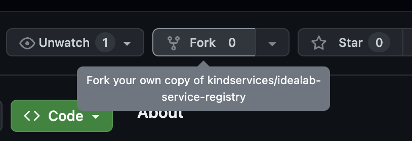

[home](./README.md)
# How to Participate

A main component of these labs is just to have fun building things together. We want as low a barrier to entry as possible for people to get into tech and start being productive.

If you've been in touch with [Kind](https://www.kindservices.co.uk), you will have a link to our morning virtual stand-up. Anybody can just drop in on those sessions, where we cover what's next to do, and help route people to the best place to get started, depending on their own experience and interests.

Beyond the stand-up, our dynamic team for the day will just coordinate how they might want to get started. Do you want to [pair-program](https://en.wikipedia.org/wiki/Pair_programming#:~:text=Pair%20programming%20is%20a%20software,two%20programmers%20switch%20roles%20frequently.) on something, perhaps at 2pm? Do you just want to explore the code yourself for a bit and maybe pop back in tomorrow? Does everybody want to have a [mobbing session](https://medium.com/bgl-tech/mobbing-vs-pair-programming-3eb1e387183d)?

Our distributed, dynamic, objective-based labs should provide a good taste of what working as part of an agile delivery team is really lke.

We keep track of our work on tickets, document the state of the project on wikis and readme files like these, and have fun helping and learning from each other.

As people make progress on their work, they will be using git to commit their changes and [push them up](https://docs.github.com/en/get-started/using-git/pushing-commits-to-a-remote-repository) to their forked repositories. If that's code that they want to contribute back to [Kind's main repo](https://github.com/kindservices), then you can open a pull request where the work is reviewed. If that work leaves the repo in a better state, then it will be accepted, and not only will you have contributed to move things forward on a real project, but you will have a public record of your work you can reference and talk about in your own career, or even use in your own projects.

All of our code is open-source and under the [Apache 2.0 license](https://www.apache.org/licenses/LICENSE-2.0). 

## Working on the code
Once you have your own free [github account](https://github.com) set up, you'll be able to "fork" the relevant repositories (or"repos"), depending on what lab or part of a lab you're working on:

You will be able to then "clone" your forked copy locally on your computer.

This may seem like a lot of steps just do download a copy of some code. The reason git works like this becomes clear when you start working collaboratively as part of a team, and everybody needs to understand and coordinate their changes.

This how nearly all modern software development works, and a big reason why collaborating on one of our labs offers practical benefit in addition to your own individual portfolio work.

# Have fun building things together!

Larners can often best learn from each other. People who have just learned a concept can be best placed to speak in the language other learners understand. There are also more seasoned collaborators who offer a wealth of experience and diversity, so collectively we should be up to make the results even better!

[home](./README.md)